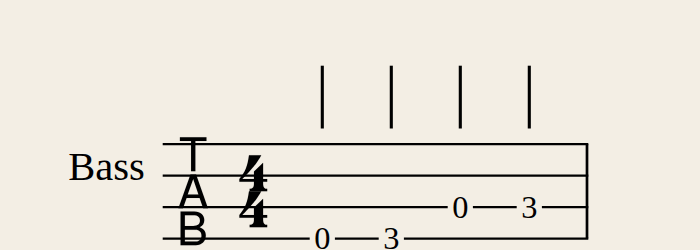

# Бас-гитара и электрогитара в MIDI Teacher: исследование и план

## Коротко

**Идея разумная.** Больше половины приложения от инструмента не зависит: режимы ожидания и ритма,
«Разучить» (фрагменты, уровни, игра по памяти), прогресс, тепловая карта, импорт MIDI, метроном,
запись, теория. Проверено: Verovio 6.3 уже умеет табулатуру. Из MusicXML со струнами и ладами он
рисует табы с ритмом и отдаёт верные высоты нот (E1 = 28, G1 = 31…). Значит, оценка игры и движок
практики заработают на табах без переделки.

**Новое и главное — вход звука.** Гитара и бас не шлют MIDI. Нужно слушать звук и превращать его
в ноты. Для **одноголосия** (бас, мелодии, рифы) это хорошо изученная задача, решается в реальном
времени с задержкой 20–60 мс. **Аккорды** — сложнее, но нам не нужно «угадывать» аккорд: мы
**знаем, что должно звучать**, и только проверяем. Это намного проще и надёжнее слепого распознавания.

**Оборудование есть:** Rocksmith Real Tone Cable — это USB-звуковая карта с инструментальным входом
(16 бит, 48 кГц). Windows видит её как устройство записи. Для старта хватит, покупать ничего не нужно.

**Решения (опросы):**
- звук гитары — через приложение (кабель сейчас, звуковая карта потом);
- форматы: ноты/MIDI → авто-таб и MusicXML с готовыми табами (Guitar Pro и текстовые табы — позже);
- библиотека: наши пьесы в табах, басовые линии из левой руки, простые пьесы из открытых источников;
- следующий этап — Г1+Г2 вместе (распознавание на синтетике, пороги — по записям); GM-банк — в нём же;
- барабаны на 8 пэдах MIDI-клавиатуры — отдельным этапом «Б» после Г1+Г2;
- бас и гитара **сразу**, одноголосие для обоих, аккорды гитары — отдельным этапом;
- вид: **табы + гриф** и падающие ноты по струнам;
- начинаем **сразу**, до этапа 7 (доводка).

---

## 1. Как звук инструмента попадает в приложение

| Вариант | Что это | Плюсы | Минусы |
|---|---|---|---|
| **А. Свой распознаватель в приложении** (рекомендую) | Звуковая карта → наше ядро на Rust: поиск начала ноты + определение высоты (YIN / McLeod) → события «нота нажата» | Ничего не нужно, кроме звуковой карты. Знаем ожидаемые ноты — можем подсказывать распознавателю. Тюнер получаем бесплатно | Самая большая часть работы. Аккорды — отдельный этап |
| **Б. Внешний конвертер звук→MIDI** | Программа вроде Jam Origin MIDI Guitar отдаёт виртуальный MIDI-порт | Приложение уже умеет MIDI — вход работает сразу | Платная программа, лишняя задержка; отдельный продукт для баса (MIDI Bass) давно не обновлялся |
| **В. MIDI-гитара** | Звукосниматель-конвертер (Fishman TriplePlay, Roland GK) или MIDI-гитара (Jamstik) | Точный полифонический MIDI | Дорого, ставится на гитару, для баса почти нет |

Вариант **Б** работает и так, без доработок: любой MIDI-вход приложение уже слушает. Поэтому делаем **А**,
а Б остаётся запасным путём.

### Что умеет распознаватель и где сложности

- **Высота (одна нота):** алгоритмы YIN / McLeod (MPM). Для Rust есть готовые крейты
  (`pitch-estimate` — YIN и MPM без выделения памяти в реальном времени; `pyin-rs`), или напишем свой (~200 строк).
- **Задержка.** Для высоты нужно окно около двух периодов звука:
  - низкая ми баса (41 Гц) — примерно 50 мс;
  - низкая ми гитары (82 Гц) — примерно 25 мс.

  **Время нажатия** берём от начала ноты (всплеск энергии), оно ловится за 5–10 мс. Поэтому оценка
  ритма остаётся точной, а подсветка запаздывает на 20–50 мс — это приемлемо.
- **Повтор той же ноты** — по всплеску энергии.
- **Легато (хаммер-он, слайд)** — по смене высоты без всплеска.
- **Октавные ошибки** (у баса слабая основная частота) — главный риск. Снимается подсказкой от
  нот: из двух кандидатов берём тот, что ближе к ожидаемой ноте. Плюс порог «чистоты» сигнала.
- **Перегруз (дисторшн)** сильно мешает. Нужен чистый сигнал — гитара прямо в звуковую карту,
  педали после (или разветвитель).
- **Аккорды.** Слепое полифоническое распознавание в реальном времени дорого. Например, у
  Spotify basic-pitch (Apache-2.0, модель 230 КБ) задержка в потоке около 2 с — для игры не годится,
  но пригодится для «запись → ноты». Для проверки аккорда достаточно другого: через ~80 мс после
  удара сравнить спектр с ожидаемыми нотами и засчитать, если нужные струны звучат, а лишних нет.
- **Звук, который слышишь ты.** Прямой мониторинг звуковой карты (кнопка Direct Monitor) или
  комбик через разветвитель. Прогонять гитару через приложение не стоит: задержка и нужен эмулятор усилителя.

### Real Tone Cable: что важно

- Это обычное USB-аудиоустройство на запись (16 бит, 48 кГц), без своего ASIO-драйвера. Работает
  через системный звук Windows (WASAPI) или через ASIO4ALL / FlexASIO, которые объединяют вход
  кабеля с выходом компьютера в одно ASIO-устройство.
- **Выхода на наушники у кабеля нет.** Пока гитара подключена к нему, без приложения её не слышно
  (электрогитару без усилителя слышно еле-еле). Поэтому приложение само **выводит звук гитары**:
  вход → чистый звук с лёгкой обработкой → колонки/наушники компьютера. Rocksmith делает так же.
- **Задержка прослушивания** — сумма входного и выходного буферов. Через ASIO4ALL/FlexASIO с
  буфером 128 — около 6–10 мс, это незаметно. Через WASAPI — 20–40 мс: для баса терпимо, для
  гитары заметно. Поэтому в «Устройства и звук» будет подсказка про ASIO4ALL/FlexASIO (FlexASIO
  мы уже советуем для рояля) и калибровка задержки.
- Если купишь звуковую карту с Hi-Z и кнопкой Direct Monitor, гитару будет слышно самой картой
  без задержки, а приложение будет только слушать. Кабель при этом не понадобится.

### Оборудование

- **USB-звуковая карта с инструментальным входом Hi-Z** — самый надёжный путь. Примеры:
  Behringer UMC22/UMC202HD, Focusrite Scarlett Solo, M-Audio M-Track, Audient EVO 4 — класс
  «первая звуковая карта». ASIO-драйвер обычно в комплекте, а ASIO у нас уже есть.
- **Комбик с USB-аудио** (есть у многих современных моделей) — тоже подходит, если отдаёт чистый
  сигнал (DI) по USB.
- **Микрофон ноутбука** — годится только для тюнера и грубой проверки.
- **Кабель:** обычный гитарный джек 6,3 мм.

---

## 2. Как показывать ноты

- **Табулатура** (4 линии для баса, 6 для гитары, номера ладов). Verovio её рисует —
  проверено на нашей сборке, скриншот ниже. Варианты вида:
  - **только табы** — привычно гитаристам;
  - **ноты + табы** (как в Guitar Pro) — полезно, если хочешь читать ноты и на гитаре. Нужен
    стан и таб одними нотами; второй стан служит только для показа.
- **Гриф вместо клавиатуры.** Струны и лады 0–12 (до 24). Подсветка «куда поставить палец»
  (струна, лад, цифра пальца левой руки). Сыгранная нота показывается на грифе.
- **Падающие ноты по струнам** («дорожка» как в Rocksmith/Yousician) вместо падения на клавиши.
  Та же идея, что у нас, другая раскладка: полоса на каждую струну, в плашке — номер лада.
- **Выбор позиции (струна + лад).** Одна высота есть на нескольких струнах. Из табов и Guitar Pro
  позиция уже известна. Для MIDI и наших упражнений её подбирает алгоритм — как наша аппликатура
  (динамическое программирование): меньше переездов по грифу, удобная позиция, открытые струны по желанию.

---

## 3. Чему учить (контент)

**Бас:**
- открытые струны;
- «найди ноту на грифе» (тренажёр грифа — аналог нашего тренажёра нот);
- хроматика 1-2-3-4;
- мажорная гамма в позиции, пентатоника;
- ходы «прима–квинта–октава», арпеджио;
- игра под барабаны;
- басовые линии из библиотеки: левая рука наших пьес — это готовые басовые партии.

**Гитара:**
- открытые струны, тренажёр грифа;
- одноголосные мелодии (все наши пьесы в удобном диапазоне);
- гаммы и пентатоника (боксы);
- рифы;
- затем аккорды (E, A, D, C, G, Am, Em, Dm), смены аккордов и бой — ритм проверяется по
  ударам, аккорд — по спектру.

**Импорт:**
- **MIDI** уже есть: выбираешь басовую или гитарную дорожку как «мою», остальное —
  аккомпанемент, включая барабаны.
- **Guitar Pro** (.gp/.gp5) — главный формат гитарных табов. Библиотека alphaTab (MPL-2.0)
  читает Guitar Pro 3–7. Её можно использовать только как разборщик, а ноты со струнами и ладами
  писать в наш MusicXML — рисовать продолжит Verovio.

**Аккомпанемент с барабанами.** Сейчас SoundFont — только рояль. Для баса важна игра под
барабаны, поэтому нужен общий GM-банк. GeneralUser GS: 30 МБ, 259 инструментов и 11 наборов
барабанов, свободная лицензия для программ. Встроенный синтезатор (rustysynth) GM-банки умеет;
нужно научить наш звуковой движок нескольким каналам с программами.

---

## 4. Что переиспользуется, что новое

| Уже есть, работает для гитары | Нужно сделать |
|---|---|
| Режимы ожидания и ритма, оценка, итоги | Вход звука (захват cpal: ASIO/WASAPI), уровень сигнала |
| «Разучить»: фрагменты, уровни, по памяти | Распознаватель: начало ноты, высота, подсказка от ожидаемых нот |
| Прогресс, тепловая карта, время занятий | Тюнер, калибровка задержки (сыграй под щелчки) |
| Импорт MIDI, выравнивание, аккомпанемент | Профиль инструмента: бас/гитара, строй, число ладов |
| Метроном, отсчёт, запись в MIDI | Табулатура в MusicXML (струна/лад), подбор позиций |
| Теория, справочник (часть карточек общие) | Гриф вместо клавиатуры, падающие ноты по струнам |
| Verovio: табы рисуются, временная карта верная | Упражнения и тренажёр грифа, карточки про табы и гриф |
|  | GM-банк и многоканальный синтез (барабаны) |
|  | Потом: проверка аккордов, бой, Guitar Pro |

Грубая оценка: по объёму это 3–4 наших этапа.

---

## 5. План (этапы Г0–Г5, после каждого — .exe и чеклист)

| # | Этап | Результат |
|---|---|---|
| Г0 | **Вход звука, прослушивание себя, тюнер** | Выбор входа (Real Tone Cable или звуковая карта), индикатор уровня, звук гитары в колонках/наушниках (чистый, громкость, лёгкая обработка), тюнер (бас, гитара, свои строи), калибровка задержки. Проверяет, что оборудование подходит |
| Г1 | **Звук → ноты (одноголосие, бас и гитара)** | Распознаватель начала и высоты, подсказка от ожидаемых нот. Гитара/бас появляется как ещё одно «устройство» — все существующие режимы работают. Тесты на синтезированных «щипках» и твоих записях; запись входа в WAV прямо из приложения («пришли мне файл») |
| Г2 | **Гриф и табы** | Профиль инструмента, табулатура (и ноты + табы), гриф вместо клавиатуры, падающие ноты по струнам, подбор позиций, импорт MIDI с «моей» басовой/гитарной дорожкой |
| Г3 | **Контент для баса и гитары** | Тренажёр грифа, упражнения ступенями, басовые линии из библиотеки, GM-банк и барабаны в аккомпанементе, карточки теории |
| Г4 | **Аккорды и бой** | Проверка аккорда по спектру, ритм боя, аппликатурные схемы аккордов, песни «аккорды + бой» |
| Г5 | **Guitar Pro** (по желанию) | Импорт .gp/.gp5 через разборщик alphaTab |

**Риски и что с ними делать:**
- **Октавные ошибки и шум** — подсказка от ожидаемых нот, порог чистоты, чистый сигнал.
  Настройки чувствительности в интерфейсе.
- **Задержка** — компенсация по калибровке; для ритма берём время начала ноты, а не момент
  распознавания высоты.
- **Дисторшн** — предупреждение и подсказка по подключению.
- **Проверить в облаке без инструмента нельзя** — тесты на синтезированных сигналах и на записях,
  которые ты пришлёшь (WAV, по 10–20 секунд: открытые струны, гамма, рифф). Финальная проверка — по чеклисту.

---

## Где брать табы

- **Открытые:** [ClassTab](https://classtab.org) — ~3000 табов классической гитары текстом, к
  большинству MIDI, весь сайт одним архивом; [Mutopia](https://sca.uwaterloo.ca/Mutopia/) — пьесы
  для гитары в общественном достоянии (LilyPond, MIDI, часть с табами); MuseScore.com — пьесы в
  общественном достоянии и авторские бесплатно скачиваются в MusicXML (с табами, если автор сделал).
- **Песни** (рок, поп) — под авторским правом: табы Songsterr / Ultimate Guitar (Guitar Pro)
  пользователь скачивает для себя и импортирует; встроить в приложение нельзя.
- **Свои ноты** — как с фортепиано: MusicXML или MIDI с партией, приложение само раскладывает
  по струнам и ладам.

## Источники

- Verovio: [форматы ввода](https://book.verovio.org/toolkit-reference/input-formats.html),
  [MusicXML](https://www.verovio.org/musicxml.html); табы проверены локально на нашей сборке Verovio 6.3.
- alphaTab (Guitar Pro 3–7, MusicXML, MPL-2.0): [alphatab.net](https://alphatab.net/).
- Высота звука на Rust: [pitch-estimate](https://docs.rs/pitch-estimate/0.1.0),
  [pyin-rs](https://lib.rs/crates/pyin-rs), [autopitch](https://docs.rs/crate/autopitch/latest).
- Spotify basic-pitch: [GitHub](https://github.com/spotify/basic-pitch),
  [README модели](https://huggingface.co/spotify/basic-pitch/raw/main/README.md).
- Jam Origin MIDI Guitar: [обзор Sound On Sound](https://www.soundonsound.com/reviews/jam-origin-midi-guitar),
  [KVR](https://www.kvraudio.com/product/midi-guitar-by-jamorigin).
- GeneralUser GS: [лицензия](https://scancode-licensedb.aboutcode.org/generaluser-gs-2.0.LICENSE),
  [справочник MuseScore о банках](https://musescore.org/it/handbook/2/librerie-di-suoni).
